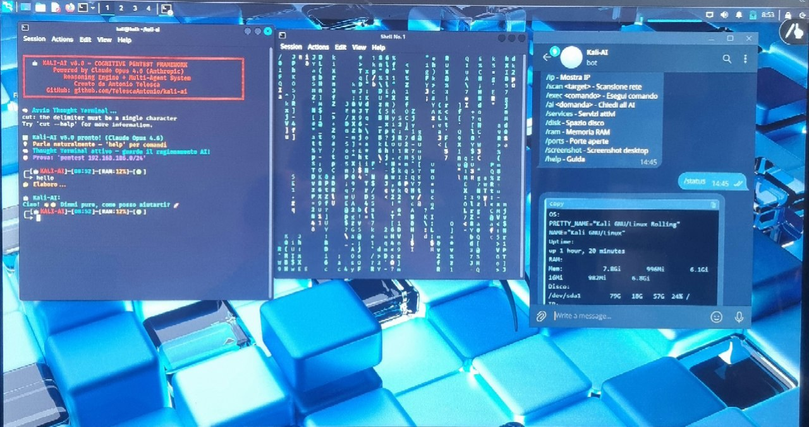

# Kali-AI v6.0 - Cognitive Pentest Framework

Autonomous AI-Powered Penetration Testing Agent for Kali Linux

Copyright 2026 Antonio Telesca - All Rights Reserved

## Legal Notice

This software is protected by copyright. All rights reserved.
Use is permitted exclusively for academic research and testing
in authorized environments.
Read the LICENSE file before any use.

## Telegram Remote Control

Kali-AI can be controlled remotely via Telegram bot.
Send commands from your phone to your Kali Linux system.

Available Telegram commands:

    /status     - System status
    /ip         - Show IP addresses
    /scan       - Network scan
    /exec       - Execute command
    /ai         - Ask the AI
    /services   - Active services
    /disk       - Disk space
    /ram        - RAM usage
    /ports      - Open ports
    /screenshot - Desktop screenshot

## Features

- Cognitive Cycle: OBSERVE - THINK - PLAN - ACT - VERIFY - LEARN
- Multi-terminal parallel execution (autonomous agents)
- Real-time AI reasoning visualization (Neural Core + Matrix effect)
- Autonomous 4-phase penetration testing
- Vulnerability database with AI analysis
- Persistent memory and learning across sessions
- Auto-install missing tools (apt/pip/git)
- System monitoring, network recon, service control
- Automatic Markdown report generation
- Thesis export function

## Requirements

- Kali Linux Rolling
- Anthropic API Key (Claude Opus 4.6)
- Internet connection
- jq, nmap, cmatrix, inotify-tools

## Installation

    git clone https://github.com/TelescaAntonio/kali-ai.git
    cd kali-ai
    echo ANTHROPIC_API_KEY=your-key > ~/.kali_ai_config
    chmod 600 ~/.kali_ai_config
    bash kali-ai.sh

## Commands

    help             Show available commands
    pentest target   Start autonomous pentest
    report           Generate system report
    benchmark target AI vs traditional comparison
    export_thesis    Export thesis materials
    snapshot         System status
    monitor          System resources
    stats            Usage statistics
    exit             Quit

## License

Copyright 2026 Antonio Telesca. All Rights Reserved.
See the LICENSE file for full details.

## Contact

Author: Antonio Telesca
Email: antoniotelesca503@gmail.com
GitHub: https://github.com/TelescaAntonio
